# Enterprise Self-Healing GitOps Platform on AWS EKS

A hands-on DevOps project that brings together AWS infrastructure, CI/CD, Docker, Kubernetes, GitOps, and monitoring into a single automated deployment workflow.

The platform is designed around a simple idea:

> **Build → Test → Containerize → Deploy → Monitor → Recover**

The project uses Terraform to provision AWS infrastructure, GitHub Actions for CI, Docker Hub for container images, Argo CD for GitOps-based deployment, Amazon EKS for Kubernetes orchestration, and Prometheus/Grafana for monitoring.

---

## Architecture

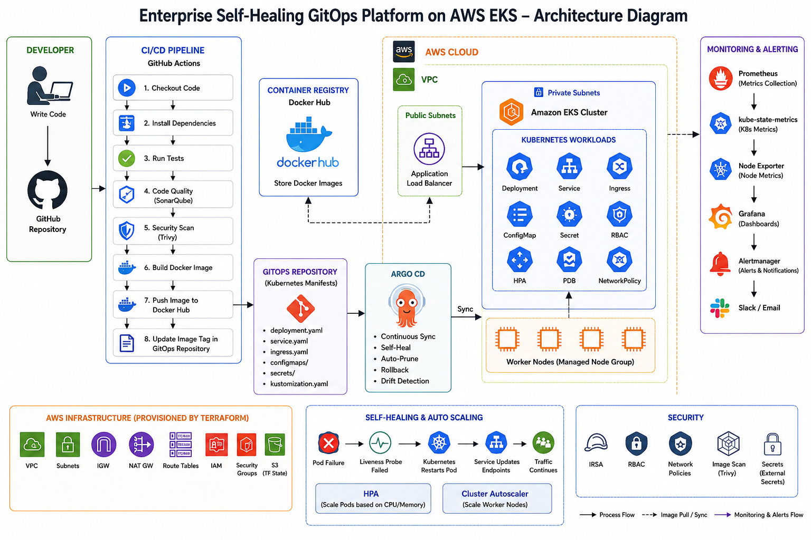

### Workflow

```text
Developer
   │
   ▼
GitHub Repository
   │
   ▼
GitHub Actions
   │
   ├── Checkout
   ├── Install Dependencies
   ├── Unit Tests
   ├── SonarQube
   ├── Trivy Scan
   └── Docker Build
        │
        ▼
   Docker Hub
        │
        ▼
GitOps Repository
        │
        ▼
     Argo CD
        │
        ▼
   Amazon EKS
        │
        ├── Kubernetes Workloads
        ├── HPA
        ├── PDB
        ├── RBAC
        └── Application Health Probes
        │
        ▼
Prometheus ─────► Grafana
```

---

## Project Highlights

- Provisioned AWS infrastructure using **Terraform**
- Built a CI pipeline using **GitHub Actions**
- Built and published container images to **Docker Hub**
- Deployed a containerized application on **Amazon EKS**
- Implemented **GitOps with Argo CD**
- Configured automated synchronization, pruning, self-healing, and drift correction
- Configured Kubernetes **Deployments, Services, ConfigMaps, Secrets, RBAC, HPA, and PDB**
- Added **startup, readiness, and liveness probes**
- Integrated **Prometheus and Grafana** for Kubernetes monitoring
- Tested Kubernetes self-healing by deleting a running backend pod and observing automatic replacement
- Used Git as the source of truth for Kubernetes configuration

---

## Technology Stack

| Category | Technologies |
|---|---|
| Cloud | AWS, Amazon EKS, EC2, VPC, IAM, S3, ALB |
| Infrastructure as Code | Terraform |
| CI | GitHub Actions |
| Containerization | Docker |
| Container Registry | Docker Hub |
| Orchestration | Kubernetes, Amazon EKS |
| GitOps | Argo CD |
| Monitoring | Prometheus, Grafana |
| Kubernetes Metrics | kube-state-metrics, Node Exporter |
| Version Control | Git, GitHub |
| Operating System | Linux |

---

## Infrastructure

AWS infrastructure is provisioned using Terraform to make the environment repeatable instead of relying on manual console configuration.

The infrastructure includes:

- VPC
- Subnets
- Internet Gateway
- NAT Gateway
- Route Tables
- IAM
- Amazon EKS
- Worker Nodes
- Application Load Balancer
- S3

The Terraform configuration provisions **72 AWS resources in approximately 20–25 minutes**, providing a repeatable infrastructure setup.

### Terraform Evidence

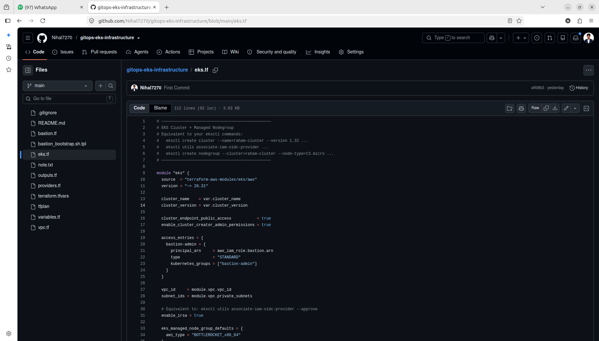

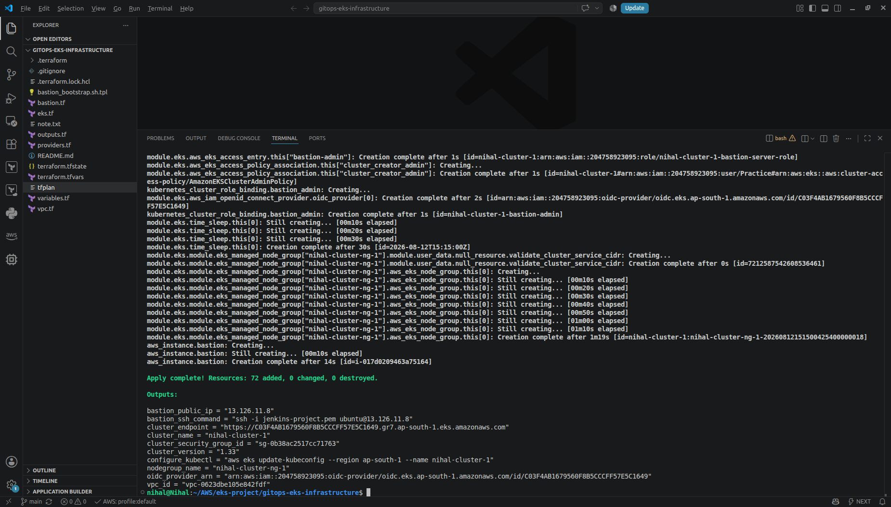

---

## CI Pipeline

GitHub Actions is used to automate the application CI workflow.

The pipeline performs:

1. Checkout source code
2. Install dependencies
3. Run unit tests
4. Perform code-quality analysis
5. Perform container vulnerability scanning
6. Build the Docker image
7. Push the image to Docker Hub
8. Update the GitOps repository with the image tag

### CI Pipeline

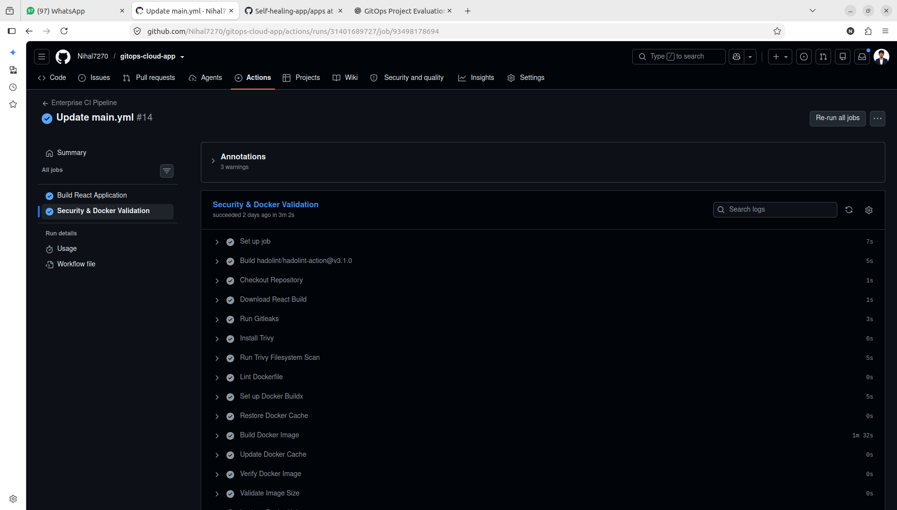

### Docker Hub Image

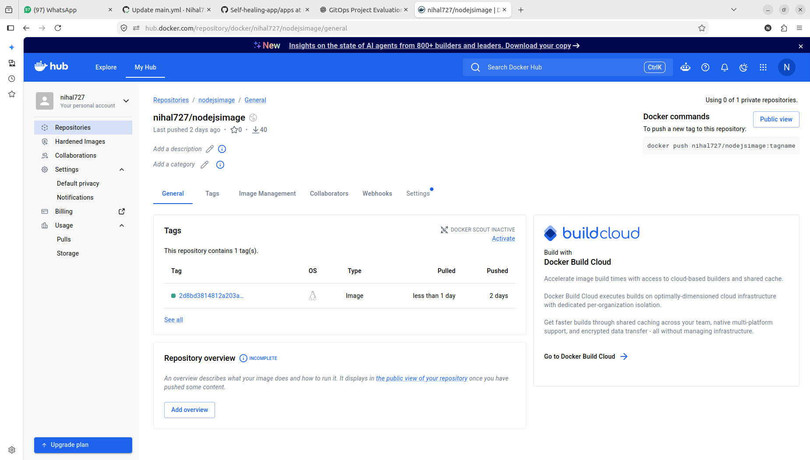

---

## Kubernetes on Amazon EKS

The application is deployed on Amazon EKS using Kubernetes manifests.

The backend workload includes:

- Deployment
- Service
- ConfigMap
- Secret
- ServiceAccount
- RBAC
- HPA
- PDB
- Resource configuration
- Startup probe
- Readiness probe
- Liveness probe

### EKS Cluster

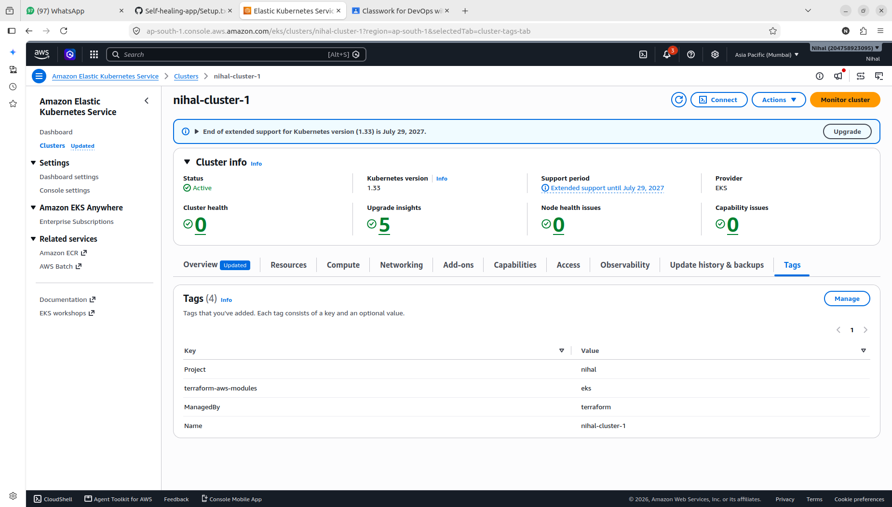

### Worker Nodes

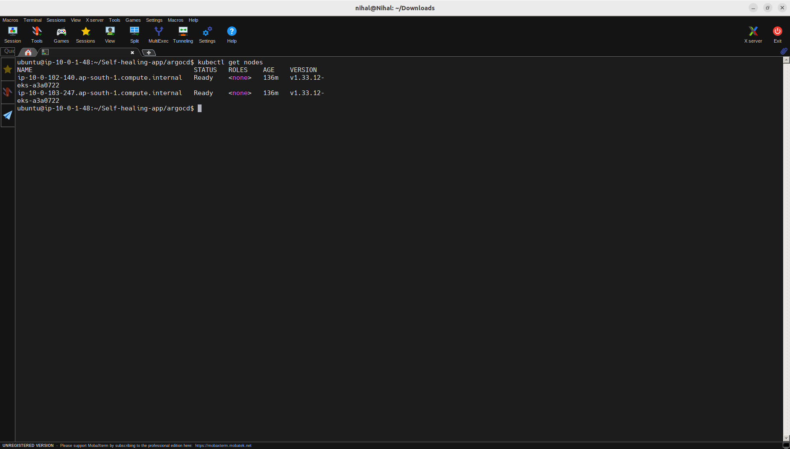

### Backend Pods

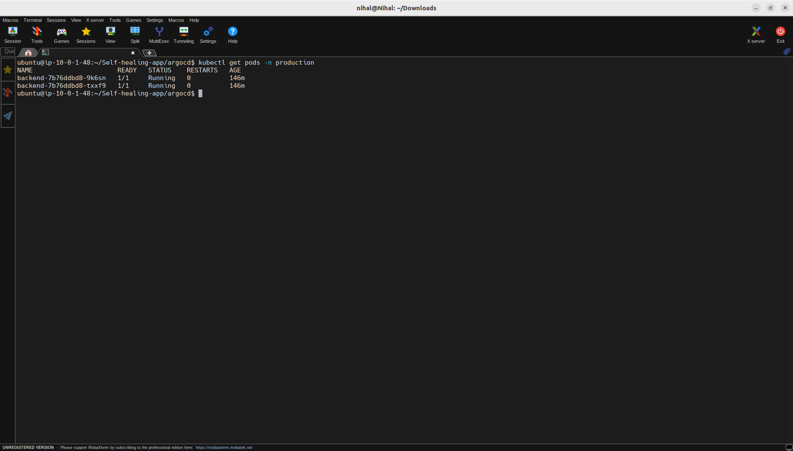

---

## GitOps with Argo CD

Argo CD manages the Kubernetes deployment using Git as the source of truth.

Instead of manually applying Kubernetes manifests to the cluster, Argo CD continuously compares the desired state stored in Git with the actual state running in EKS.

The configuration supports:

- Automated synchronization
- Self-healing
- Automatic pruning
- Drift detection
- Git-based deployment management

### GitOps Repository

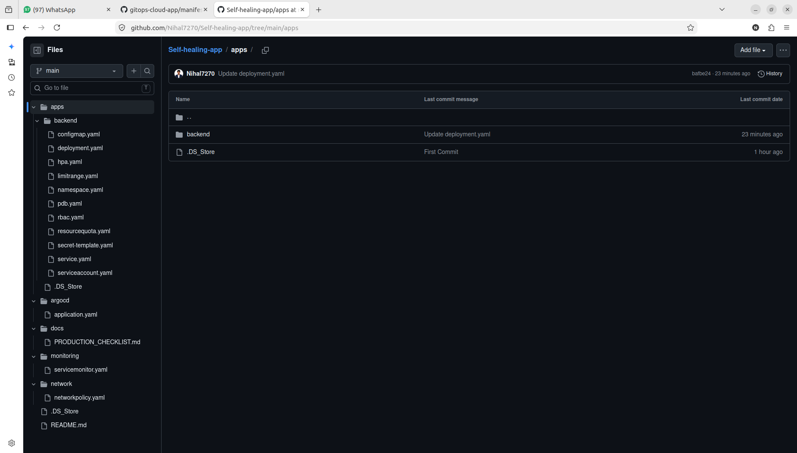

### Argo CD Synchronization

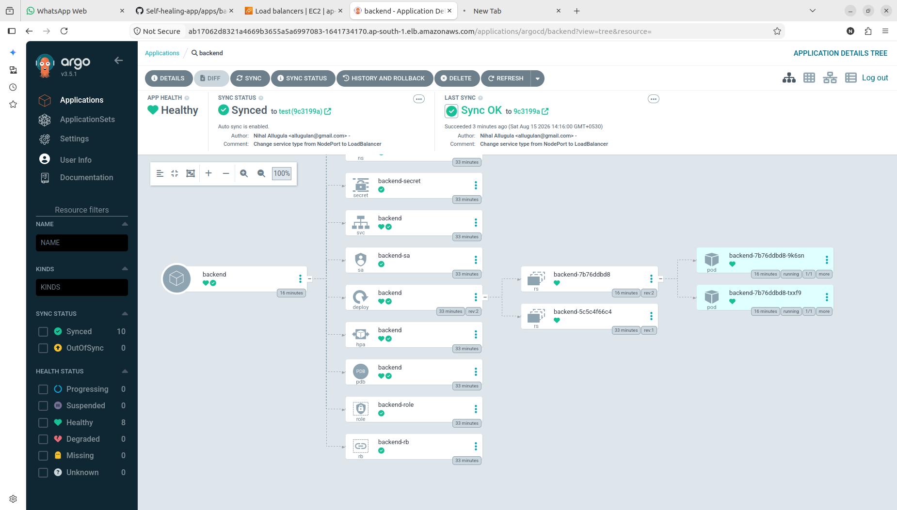

---

## Application Deployment

The backend application is exposed through a Kubernetes Service and AWS Load Balancer.

### Backend Load Balancer

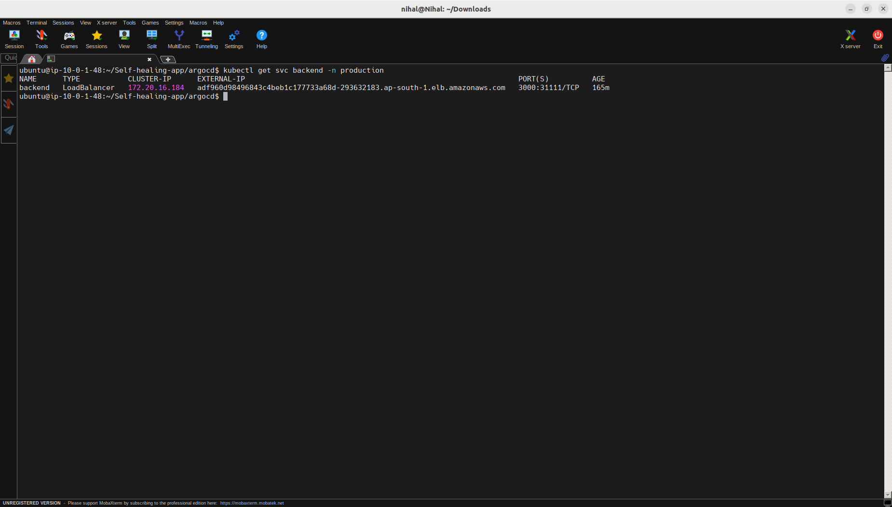

### Application Running


---

## Monitoring & Observability

Prometheus is used to collect Kubernetes metrics, while Grafana provides dashboards for visualizing the collected metrics.

Monitoring covers areas such as:

- Cluster health
- Node status
- Pod status
- CPU utilization
- Memory utilization
- Deployments
- Kubernetes resources
- Application workloads

The repository also includes a `ServiceMonitor` configuration for Kubernetes service monitoring.

### Grafana Dashboard

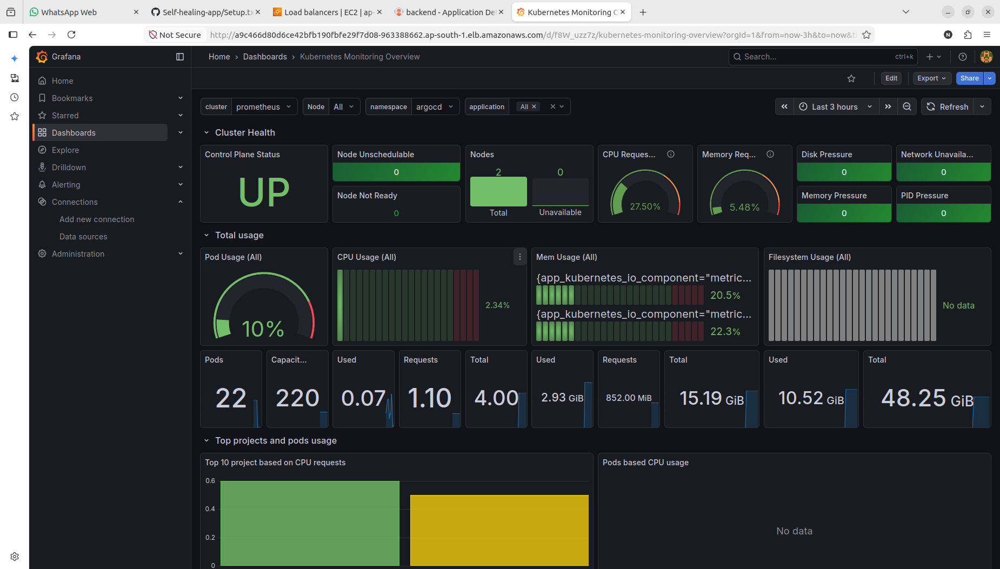

---

## Scaling & Availability

The application uses Kubernetes mechanisms to improve availability and resilience.

### Horizontal Pod Autoscaler

HPA is configured to scale backend pods based on resource utilization.

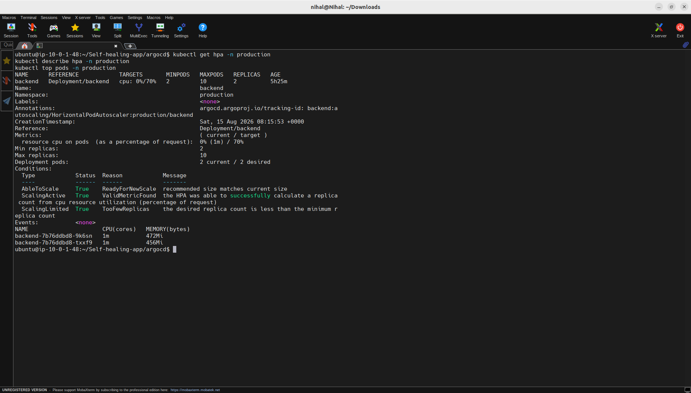

### Pod Disruption Budget

A PDB is configured to maintain application availability during voluntary disruptions.

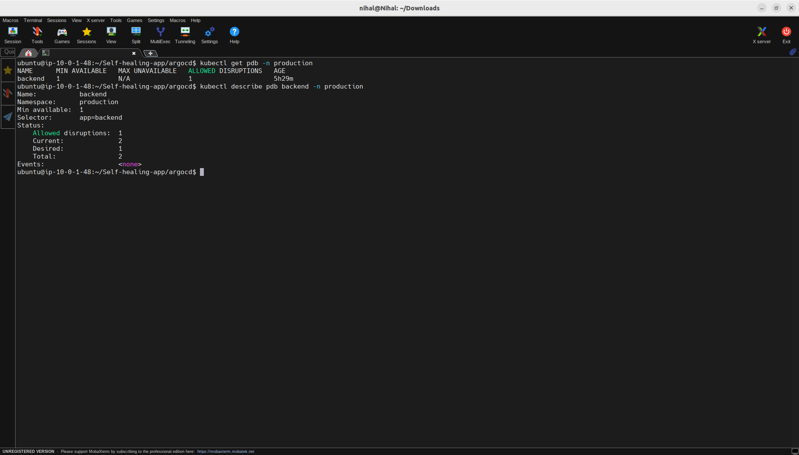

---

## Self-Healing Test

One of the main goals of this project was to verify Kubernetes self-healing behavior rather than simply configuring it.

The test was performed by manually deleting a running backend pod.

### Test Flow

```text
2 Backend Pods Running
        │
        ▼
Delete One Pod
        │
        ▼
Kubernetes Detects Missing Replica
        │
        ▼
Replacement Pod Created
        │
        ▼
2 Backend Pods Running Again
```

### Self-Healing Evidence

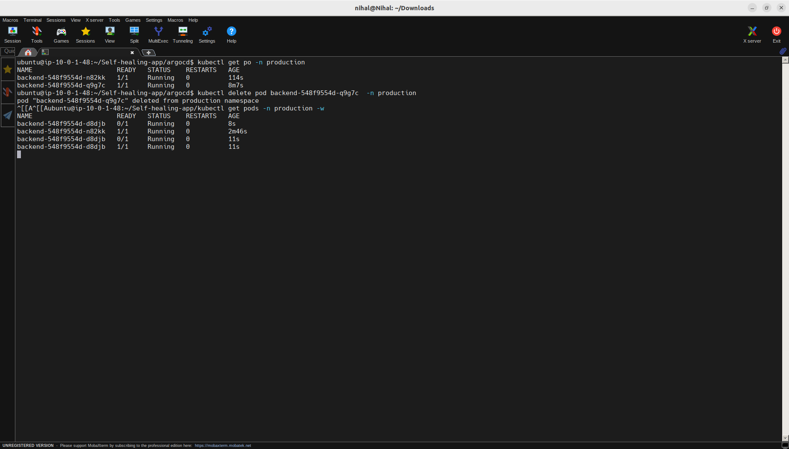

This demonstrates Kubernetes maintaining the desired replica state automatically after a pod failure.

---

## Repository Structure

```text
.
├── apps/
│   └── backend/
│       ├── configmap.yaml
│       ├── deployment.yaml
│       ├── hpa.yaml
│       ├── limitrange.yaml
│       ├── namespace.yaml
│       ├── pdb.yaml
│       ├── rbac.yaml
│       ├── resourcequota.yaml
│       ├── secret-template.yaml
│       ├── serviceaccount.yaml
│       └── service.yaml
│
├── argocd/
│   └── application.yaml
│
├── docs/
│   ├── 01_CI_Pipeline_Success.png
│   ├── 02_DockerHub_Image.png
│   ├── 03_Terraform_EKS_Infrastructure.png
│   ├── 04_Terraform_Apply_Success.png
│   ├── 05_EKS_Cluster_Active.png
│   ├── 06_EKS_Nodes_Ready.png
│   ├── 07_GitOps_Repository.png
│   ├── 08_ArgoCD_Test_Branch_Synced.png
│   ├── 09_Backend_Pods_Running.png
│   ├── 10_Backend_LoadBalance.png
│   ├── 11_Application_Running.png
│   ├── 12_Grafana_Kubernetes_Overview.png
│   ├── 14_HPA_Healthy.png
│   ├── 15_PDB_Healthy.png
│   ├── 16_SelfHealing_Pod_Replacement.png
│   ├── EKS-Architecture.png
│   └── PRODUCTION_CHECKLIST.md
│
├── monitoring/
│   └── servicemonitor.yaml
│
├── network/
│   └── networkpolicy.yaml
│
├── README.md
└── setup.txt
```

---

## Key Learning

The biggest learning from this project was understanding how the individual DevOps tools fit together as one workflow.

Terraform handles infrastructure provisioning.

GitHub Actions handles the CI process.

Docker packages the application.

Kubernetes runs and manages the workloads.

Argo CD continuously reconciles the desired state from Git.

Prometheus collects metrics.

Grafana turns those metrics into useful dashboards.

Together, these components create a repeatable workflow for deploying, operating, monitoring, and recovering an application on AWS.

---

## What I Practiced

- AWS infrastructure provisioning
- Infrastructure as Code with Terraform
- CI automation with GitHub Actions
- Docker image creation and publishing
- Kubernetes workload management
- Amazon EKS
- GitOps with Argo CD
- Kubernetes health probes
- Horizontal Pod Autoscaling
- Pod Disruption Budgets
- Kubernetes RBAC
- Prometheus monitoring
- Grafana dashboards
- Kubernetes troubleshooting
- Self-healing validation

---

## Project Status

**Completed and tested**

The project includes implementation evidence for infrastructure provisioning, CI, Docker image publishing, EKS deployment, GitOps synchronization, application deployment, monitoring, HPA, PDB, and Kubernetes self-healing.

---

## Author

**Nihal Allugula**

AWS Cloud & DevOps Engineer

- LinkedIn: https://www.linkedin.com/in/nihal727/
- GitHub: https://github.com/Nihal7270
